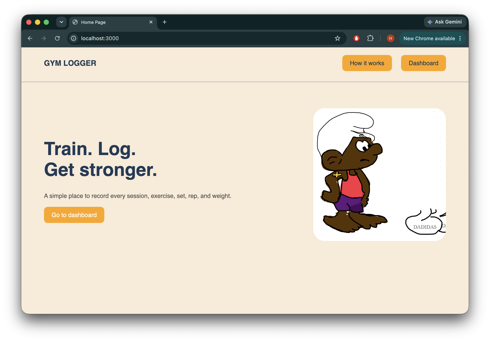
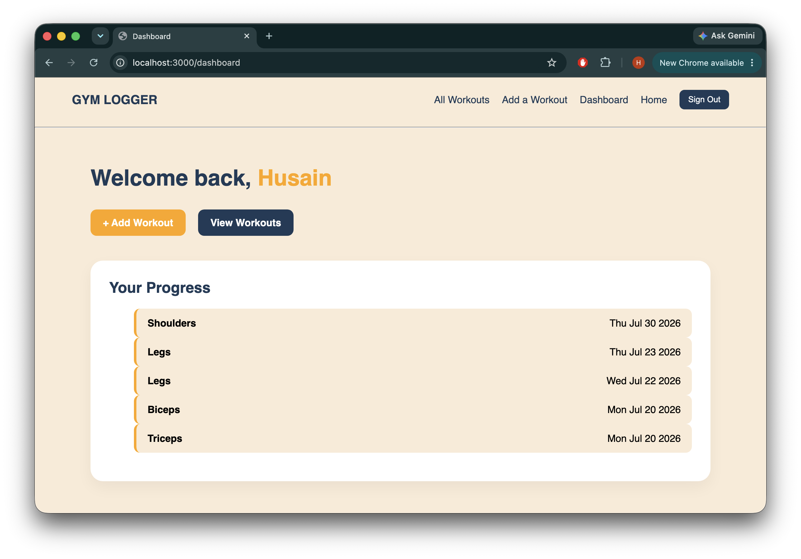
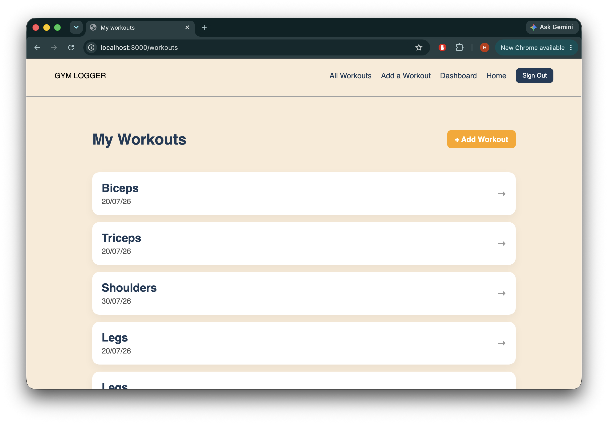

# Gym Logger

Gym Logger is a simple web application that helps users record and manage their gym workouts and exercises. Users can create an account, sign in, add workouts, add exercises, and track their recent activity from the dashboard.



## Features

- User sign-up, sign-in, and sign-out
- Create, view, edit, and delete workouts
- Add exercises to each workout
- Edit and delete exercises
- View recent workouts on the dashboard
- Each user can only view their own workout data

## Screenshots

### Dashboard



### Workouts



## Getting Started

### Installation

Clone the repository and install the required packages:

```bash
git clone https://github.com/HusainAlmajed/Gym_Logger
cd Gym_Logger-main
npm install
```

Create a `.env` file in the main project folder:

```env
MONGODB_URI
SESSION_SECRET
PORT=3000
```

Start the application:

```bash
npm start
```

Then open this address in your browser:

```text
http://localhost:3000
```

## How to Use

1. Create a new account or sign in.
2. Open the dashboard.
3. Click **Add Workout** and enter the workout details.
4. Add exercises with their weight, sets, and reps.
5. View, edit, or delete your saved workouts and exercises.

## Technologies Used

- Node.js
- Express.js
- MongoDB and Mongoose
- EJS
- HTML and CSS
- JavaScript
- Express Session and bcrypt

## Future Enhancements

- Add workout progress charts
- Add exercise search and filtering
- Add personal workout goals

## Credits

Built by Husain Almajed as part of the Software Engineering Bootcamp project.

Special thanks to the instructors and IAs for their guidance and support.